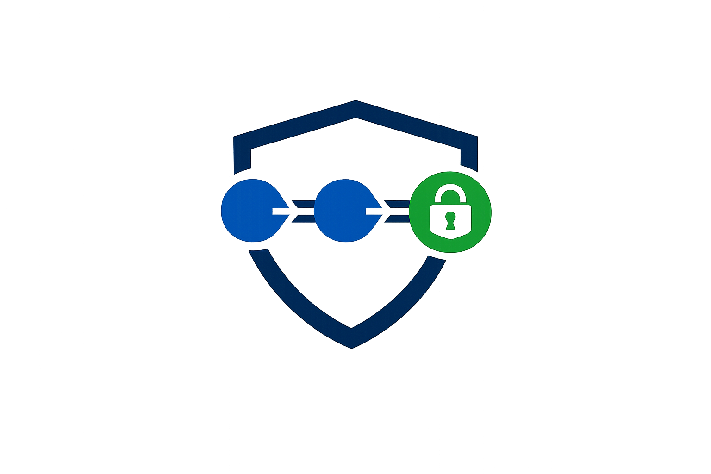
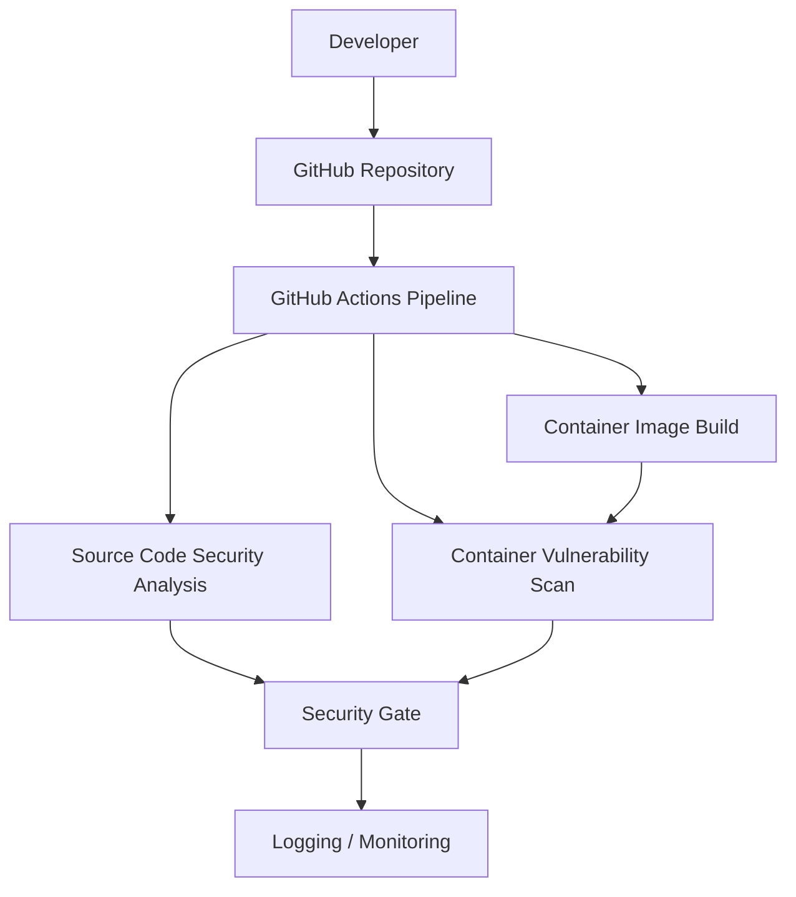

<p align="center">
  
</p>

<h1 align="center">Secure DevOps Pipeline for Containerized Application</h1>

<h2 align="center">Overview</h2>

This repository is structured to support a university DevSecOps project focused on building a secure CI/CD pipeline for a containerized web application. The project design integrates security validation into the software delivery process so that source code, dependencies, and container images can be assessed before deployment decisions are made.

<h2 align="center">Objective</h2>

The objective is to demonstrate how vulnerable source code or insecure container images can be automatically detected and blocked before delivery. The repository provides a clear project foundation for showing how security controls can be embedded into a DevOps workflow without separating security from development and operations activities.

<h2 align="center">DevSecOps Concept</h2>

DevSecOps extends DevOps by integrating security practices directly into development, testing, build, and delivery processes. In a CI/CD pipeline, this means that security checks are executed automatically when changes are introduced, allowing insecure code patterns, vulnerable dependencies, and unsafe container images to be identified early.

<h2 align="center">High-Level Architecture</h2>

```text
Developer
  |
  v
GitHub Repository
  |
  v
GitHub Actions Pipeline
  |
  |-- Source Code Security Analysis
  |-- Container Image Build
  |-- Container Vulnerability Scan
  |-- Security Gate
  |
  v
Logging / Monitoring
```



<h2 align="center">Repository Structure</h2>

```text
.
├── README.md
├── assets/
│   └── DevSecOps.png
├── frontend/
│   └── README.md
├── backend/
│   └── README.md
└── docs/
    └── README.md
```

The `assets` directory is reserved for project visual materials, including the `DevSecOps.png` logo referenced at the top of this README. The `frontend` directory is reserved for a simple user-facing interface or static demonstration page. The `backend` directory is reserved for the main application component that can be containerized and analyzed by the security pipeline. The `docs` directory contains supporting documentation for architecture, pipeline design, security decisions, demonstration scenarios, and results.

<h2 align="center">Team Roles</h2>

The project responsibilities are distributed across the team according to the main architectural areas of the repository.

| Team member | Responsibility |
| --- | --- |
| Ernest Kudakaev | Documentation and CI/CD pipeline design |
| Zakhar Bolshakov | Backend development with Go/Golang |
| Nikita Khripunkov | Backend development with Go/Golang |
| Maria Chagodaeva | Design and frontend development |

<h2 align="center">Technology Stack</h2>

The project design is based on the following technologies and security tools:

- GitHub Actions for CI/CD automation
- Docker for application containerization
- Go/Golang for the backend application component
- Semgrep or Bandit for Static Application Security Testing
- Trivy for container image vulnerability scanning
- ELK Stack or Wazuh for centralized logging and monitoring

These tools define the intended technical direction of the project foundation and are described as part of the secure pipeline design.

<h2 align="center">Security Validation Stages</h2>

The pipeline design includes Static Application Security Testing to identify insecure source code patterns before delivery. It also includes dependency and container image vulnerability scanning to detect known security issues in application packages and container layers.

Security gates are intended to fail the delivery process when critical findings are detected. Security-related pipeline events, scan outcomes, and blocked delivery decisions can be recorded for analysis through centralized logging or monitoring.

<h2 align="center">Demonstration Scenarios</h2>

The project is designed to support three demonstration scenarios. In the first scenario, secure code passes the pipeline and reaches the delivery stage. In the second scenario, insecure source code is detected by SAST and blocked by the security gate. In the third scenario, a vulnerable container image is identified by Trivy and blocked before delivery.

<h2 align="center">Logging and Monitoring Concept</h2>

Logging and monitoring provide visibility into security-relevant events across the pipeline. The project design can include records of source code scan results, container vulnerability scan results, failed security gates, and delivery decisions. A centralized logging or monitoring platform such as ELK Stack or Wazuh can be used to support auditability and analysis.

<h2 align="center">Expected Outcome</h2>

The expected outcome is a proof-of-concept DevSecOps pipeline foundation that demonstrates automated security checks and delivery blocking for insecure changes. The repository separates application areas and documentation so the project can clearly present the relationship between application code, containerization, CI/CD automation, security validation, and monitoring.
