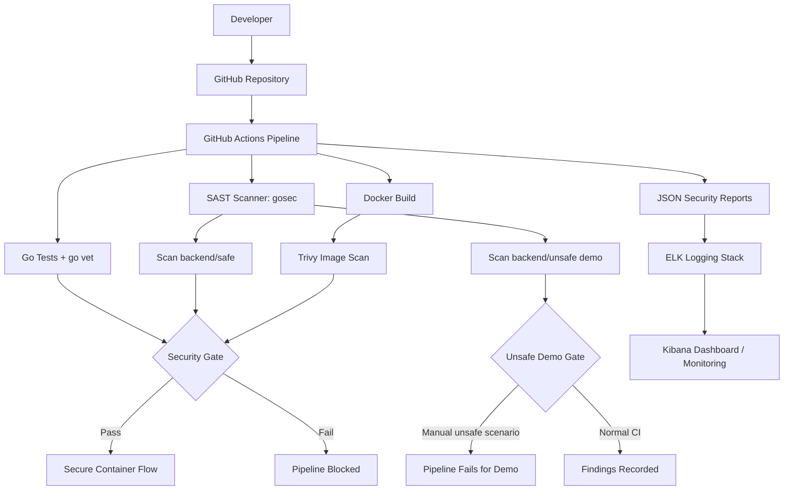

<p align="center">
  
</p>

# Secure DevOps Pipeline for Containerized Application

This repository is a university DevSecOps project that demonstrates how security checks can be added directly to a CI/CD workflow for a containerized application. The project keeps two backend examples:

- `backend/safe` is the secure Go service used for the passing delivery path.
- `backend/unsafe` is intentionally vulnerable and exists only to demonstrate SAST detection and a failed security gate.

The project is designed for a live presentation: a developer pushes code, GitHub Actions runs tests and security scans, reports are exported as artifacts, and the monitoring stack can ingest those reports for review in Kibana.

## Team Roles

| Team member | Responsibility |
| --- | --- |
| Ernest Kudakaev | Documentation, CI/CD pipeline, DevSecOps integration |
| Zakhar Bolshakov | Backend development |
| Nikita Khripunkov | Backend development |
| Mariia Chegodaeva | Frontend and design |

## DevSecOps Architecture



## Implemented Pipeline

The DevSecOps workflow is defined in `.github/workflows/devsecops.yml` and runs on:

- pushes to `main`
- pull requests targeting `main`
- manual `workflow_dispatch` runs

Pipeline stages:

1. Checkout repository.
2. Setup Go from the backend module version.
3. Download Go module dependencies.
4. Run tests for `backend/safe`.
5. Run `go vet` for `backend/safe`.
6. Run gosec SAST for `backend/safe` and `backend/unsafe`.
7. Build the `backend/safe` Docker image.
8. Scan the image with Trivy.
9. Apply security gates.
10. Upload JSON security reports as GitHub Actions artifacts.

## Security Gates

The safe delivery path fails if:

- `go test` fails
- `go vet` reports problems
- gosec reports findings in `backend/safe`
- Trivy finds HIGH or CRITICAL vulnerabilities in the safe backend image

The unsafe demo path is handled separately. `backend/unsafe` is always scanned so the findings appear in logs and artifacts. On normal push and pull request runs, those findings are recorded for education without breaking the safe delivery path. On a manual `workflow_dispatch` run with `scenario=unsafe` or `scenario=all`, the unsafe gate intentionally fails to demonstrate how vulnerable code is blocked.

## Application Docker Compose

Start the frontend together with the safe backend:

```bash
docker compose up --build
```

The services are exposed locally:

```text
Frontend: http://localhost:3000
Backend:  http://localhost:18080
```

The frontend Docker image proxies `/backend/*` requests to the safe backend container, so the live backend panel works from the composed stack.

Override host ports if needed:

```bash
FRONTEND_PORT=3001 BACKEND_PORT=8080 docker compose up --build
```

Stop the application stack:

```bash
docker compose down
```

## Monitoring

The repository includes a lightweight ELK monitoring setup in `docker-compose.monitoring.yml`. It mounts the local `reports/` directory, reads JSON scan outputs through Logstash, stores them in Elasticsearch, and exposes Kibana for dashboard review.

Start the monitoring stack locally:

```bash
docker compose -f docker-compose.monitoring.yml up
```

After scan reports exist in `reports/`, open Kibana at:

```text
http://localhost:5601
```

## Repository Structure

```text
.
|-- .github/workflows/devsecops.yml
|-- README.md
|-- docker-compose.monitoring.yml
|-- assets/
|-- backend/
|   |-- safe/
|   |-- unsafe/
|   `-- README.md
|-- docs/
|   `-- README.md
|-- frontend/
`-- monitoring/logstash/pipeline/devsecops-reports.conf
```

## Demonstration Scenarios

Safe scenario:

- push or open a pull request to `main`
- the safe backend passes tests, vet, SAST, Docker build, and Trivy scan
- reports are uploaded as artifacts

Unsafe scenario:

- manually run the workflow from GitHub Actions
- choose `scenario=unsafe` or `scenario=all`
- gosec scans `backend/unsafe`
- the workflow prints findings and intentionally fails the unsafe security gate

This gives clear evidence of CI/CD automation, vulnerability detection, secure container scanning, security gates, and monitoring integration.
